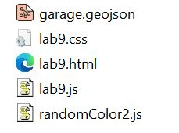
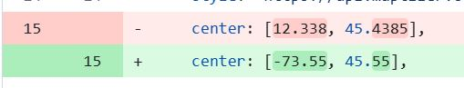
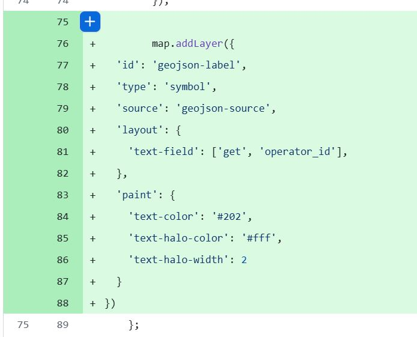
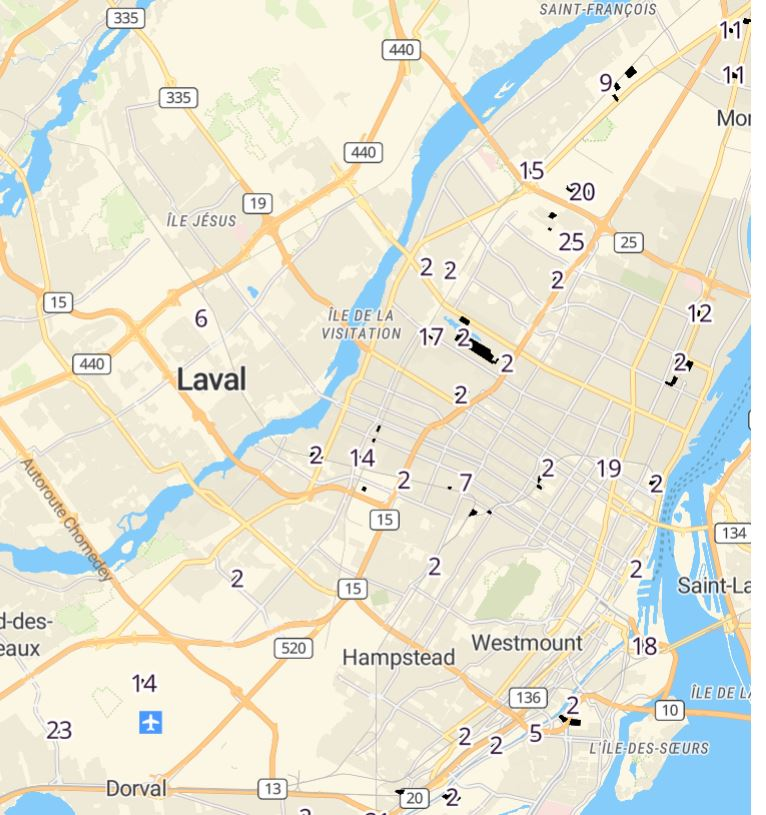
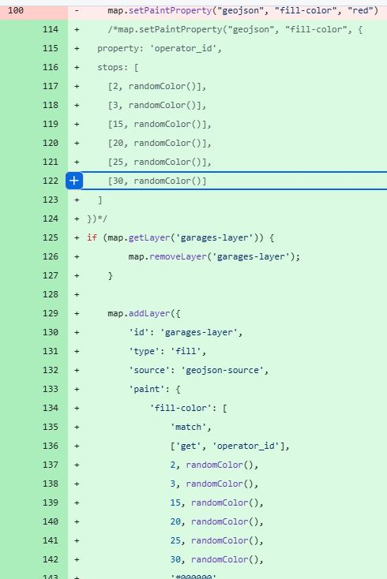
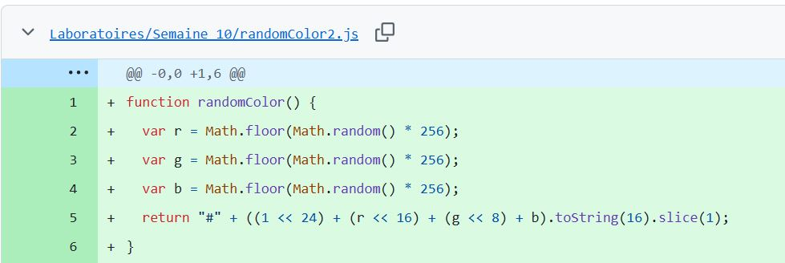
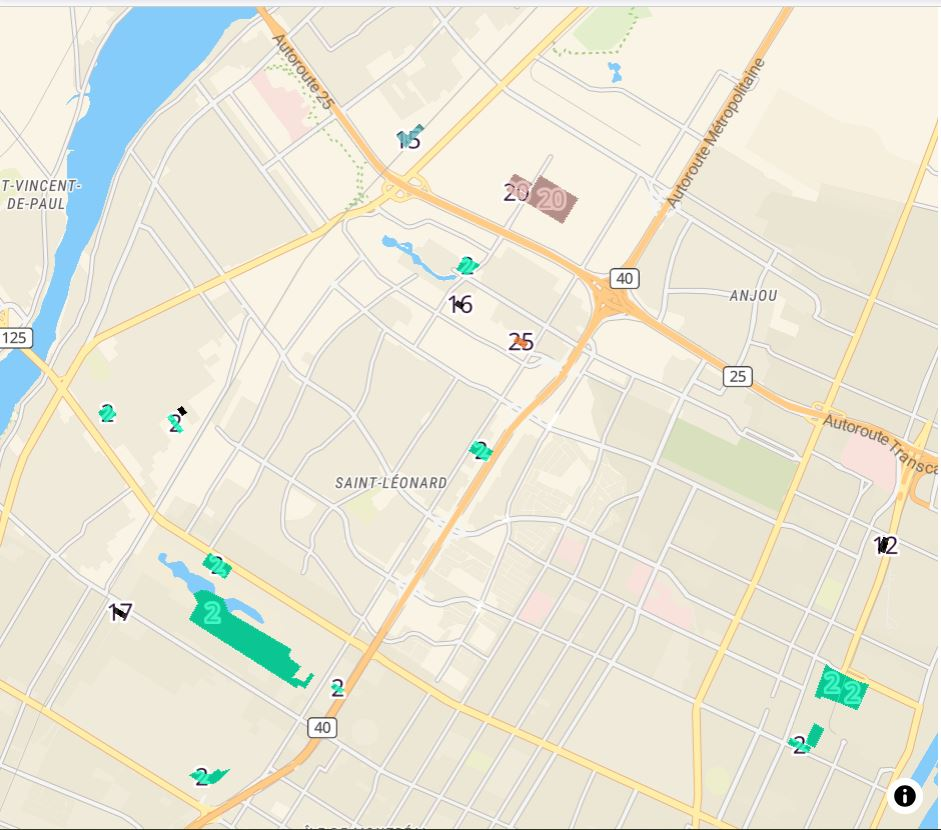

# **Laboratoire 10**

**Objectif : Exploration du webmapping Open Source à travers MaplibreGL**

Grâce à la librairie JavaScript de Maplibre GL, nous pouvons intégrer des cartes interactives dans nos projets et apprendre à effectuer des opérations sur nos données.

Dans le cadre de ce laboratoire, nous avons appris à modifier les coordonnées et la couleur de nos polygones, à créer une fonction qui génère des couleurs aléatoires, à assigner des couleurs thématiques en fonction des attributs, à ajouter une couche d’étiquettes, etc.

## **1.	Chargement de l’application et modification du code**

-	Nos fichiers ont été téléchargés dans un répertoire commun, puis nous avons ouvert le fichier HTML

-	À partir du fichier lab9.js, nous avons remplacé les valeurs des coordonnées géographiques fournies par celle correspondant à la ville de Montréal.

## **2.	Ajout d’un polygone et modification de la couleur**

-	À partir du bouton préparé sur l’application HTML, on ajoute le fichier GeoJSON des polygones

-	Avec la déclaration de la fonction colorPolygones() du fichier .js, nous avons changé la couleur des polygones.

## **3.	Ajout d’un polygone et modification de la couleur**

-	Création d’une nouvelle fonction de couleur aléatoire en créant un nouveau fichier randomColor.js
-	Le nouveau fichier a été ajouté dans le fichier .html
-	Une couleur aléatoire a été ensuite appliquée sur nos polygones avec la fonction color : randomColor()
-	Nous avons appliqué une symbologie thématique par id (operator_id) pour donner une couleur particulière pour chacun d'entre eux.

## **4.	Ajout des étiquettes aux polygones**

Nous avons ajouté un nouveau code pour nous permettre d’ajouter une nouvelle couche d’étiquettes à nos polygones, avec la fonction handleFileSelect

Les changements ont été ajoutés comme fichier directement dans GitHub.
