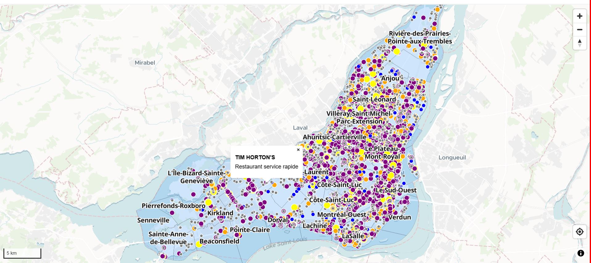
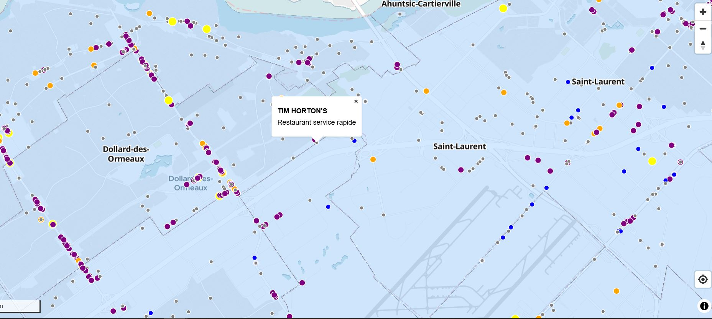

# **Laboratoire 12**

**Objectif : Apprendre à construire l’architecture d’une application web de cartographie interactive**

Avec un nouveau codespaces, nous avons:

## **1.	Initialiser la carte**

Nous avons créé un fichier map-controls.js dans lequel on a injecté la carte (var map = new maplibregl.Map()) et ses contrôleurs.

Trois variables ont été ajoutées dans le fichier map-controls.js pour le :

-	Contrôle de navigation (var nav = new maplibregl.NavigationControl())
-	Contrôle de géolocalisation (var geolocateControl = new maplibregl.GeolocateControl())
-	Contrôle d’échelle (var scale = new maplibregl.ScaleControl())

## **2.	Ajout des couches de données**

On crée un nouveau fichier « map-layers.js » puis on y ajoute des variables pour créer nos deux layers (var commercesLayer et var arrondissementsLayer).

Avant chaque ajout de la variable, nous avons d’abord déclaré la source de la donnée de type geojson avec var commercesSource et var arrondissementsSource. 

## **3.	Chargement des couches dans la carte**

On crée un nouveau fichier « app-js » dans lequel on injecte nos layers créés dans map-layers.js
Avec la fonction map.on, on ajoute non seulement la source de nos données, mais aussi les couches.

## **4.	Ajout des interactions souris**

On crée un nouveau fichier « mouse-controls.js » dans lequel on injecte les contrôleurs de souris de sorte qu’au survol, on voit le curseur changer et au clic, on voit afficher le popup avec le nom et le type avec application d’un zoom rectangulaire.

